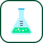

# 🖼️ 素材分類：management

> [🏠 主目錄](../../../../../README.md) / [images](../../../../README.md) / [iCons](../../../README.md) / [Webskills](../../README.md) / [Team Collaboration](../README.md) / **management**

本目錄共有 `5` 個檔案

| 🎨 預覽 (點擊放大)  | 📋 檔案詳細資訊與連結 |
| :--- | :--- |
|  | **📂 檔名:** `agile-development.svg` ✨ **格式:** `Vector (SVG)` ⚖️ **大小:** `6.17KB` 📅 **更新:** `2026-03-02`  🚀 **jsDelivr Markdown:** `` 🔗 **直接連結 (Url):** <code>https://cdn.jsdelivr.net/gh/barry028/materials@main/images/iCons/Webskills/Team%20Collaboration/management/agile-development.svg</code> 📥 [檢視原始檔](agile-development.svg) |
|  | **📂 檔名:** `kanban.svg` ✨ **格式:** `Vector (SVG)` ⚖️ **大小:** `3.30KB` 📅 **更新:** `2026-03-02`  🚀 **jsDelivr Markdown:** `` 🔗 **直接連結 (Url):** <code>https://cdn.jsdelivr.net/gh/barry028/materials@main/images/iCons/Webskills/Team%20Collaboration/management/kanban.svg</code> 📥 [檢視原始檔](kanban.svg) |
|  | **📂 檔名:** `scrum.svg` ✨ **格式:** `Vector (SVG)` ⚖️ **大小:** `2.73KB` 📅 **更新:** `2026-03-02`  🚀 **jsDelivr Markdown:** `` 🔗 **直接連結 (Url):** <code>https://cdn.jsdelivr.net/gh/barry028/materials@main/images/iCons/Webskills/Team%20Collaboration/management/scrum.svg</code> 📥 [檢視原始檔](scrum.svg) |
|  | **📂 檔名:** `test-driven-development.svg` ✨ **格式:** `Vector (SVG)` ⚖️ **大小:** `4.13KB` 📅 **更新:** `2026-03-02`  🚀 **jsDelivr Markdown:** `` 🔗 **直接連結 (Url):** <code>https://cdn.jsdelivr.net/gh/barry028/materials@main/images/iCons/Webskills/Team%20Collaboration/management/test-driven-development.svg</code> 📥 [檢視原始檔](test-driven-development.svg) |
|  | **📂 檔名:** `waterfall-development.svg` ✨ **格式:** `Vector (SVG)` ⚖️ **大小:** `5.87KB` 📅 **更新:** `2026-03-02`  🚀 **jsDelivr Markdown:** `` 🔗 **直接連結 (Url):** <code>https://cdn.jsdelivr.net/gh/barry028/materials@main/images/iCons/Webskills/Team%20Collaboration/management/waterfall-development.svg</code> 📥 [檢視原始檔](waterfall-development.svg) |