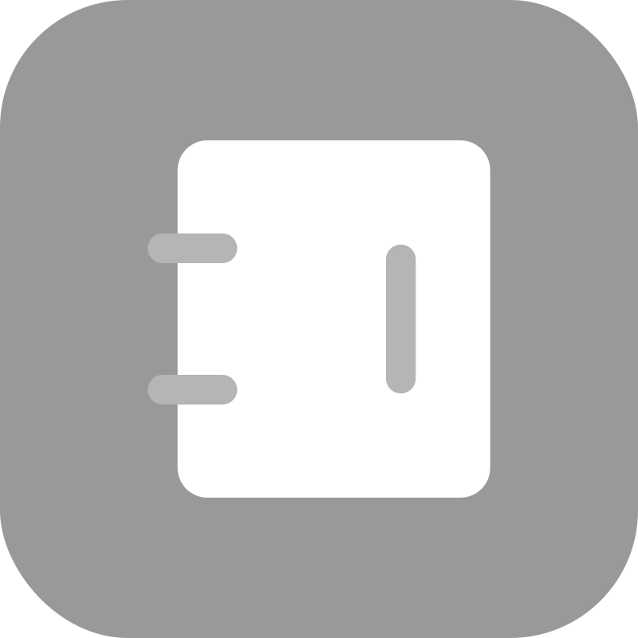

# 🖼️ 素材分類：iConly Negative Space iCons

> [🏠 主目錄](../../../README.md) / [images](../../README.md) / [iCons](../README.md) / **iConly Negative Space iCons**

本目錄共有 `15` 個檔案

| 🎨 預覽 (點擊放大)  | 📋 檔案詳細資訊與連結 |
| :--- | :--- |
|  | **📂 檔名:** `camera.svg` ✨ **格式:** `Vector (SVG)` ⚖️ **大小:** `1.58KB` 📅 **更新:** `2026-02-27`  🚀 **jsDelivr Markdown:** `` 🔗 **直接連結 (Url):** <code>https://cdn.jsdelivr.net/gh/barry028/materials@main/images/iCons/iConly%20Negative%20Space%20iCons/camera.svg</code> 📥 [檢視原始檔](camera.svg) |
|  | **📂 檔名:** `chat.svg` ✨ **格式:** `Vector (SVG)` ⚖️ **大小:** `1.20KB` 📅 **更新:** `2026-02-27`  🚀 **jsDelivr Markdown:** `` 🔗 **直接連結 (Url):** <code>https://cdn.jsdelivr.net/gh/barry028/materials@main/images/iCons/iConly%20Negative%20Space%20iCons/chat.svg</code> 📥 [檢視原始檔](chat.svg) |
|  | **📂 檔名:** `communication.svg` ✨ **格式:** `Vector (SVG)` ⚖️ **大小:** `2.12KB` 📅 **更新:** `2026-02-27`  🚀 **jsDelivr Markdown:** `` 🔗 **直接連結 (Url):** <code>https://cdn.jsdelivr.net/gh/barry028/materials@main/images/iCons/iConly%20Negative%20Space%20iCons/communication.svg</code> 📥 [檢視原始檔](communication.svg) |
|  | **📂 檔名:** `delete.svg` ✨ **格式:** `Vector (SVG)` ⚖️ **大小:** `2.91KB` 📅 **更新:** `2026-02-27`  🚀 **jsDelivr Markdown:** `` 🔗 **直接連結 (Url):** <code>https://cdn.jsdelivr.net/gh/barry028/materials@main/images/iCons/iConly%20Negative%20Space%20iCons/delete.svg</code> 📥 [檢視原始檔](delete.svg) |
|  | **📂 檔名:** `hospital.svg` ✨ **格式:** `Vector (SVG)` ⚖️ **大小:** `1.81KB` 📅 **更新:** `2026-02-27`  🚀 **jsDelivr Markdown:** `` 🔗 **直接連結 (Url):** <code>https://cdn.jsdelivr.net/gh/barry028/materials@main/images/iCons/iConly%20Negative%20Space%20iCons/hospital.svg</code> 📥 [檢視原始檔](hospital.svg) |
|  | **📂 檔名:** `important.svg` ✨ **格式:** `Vector (SVG)` ⚖️ **大小:** `1.17KB` 📅 **更新:** `2026-02-27`  🚀 **jsDelivr Markdown:** `` 🔗 **直接連結 (Url):** <code>https://cdn.jsdelivr.net/gh/barry028/materials@main/images/iCons/iConly%20Negative%20Space%20iCons/important.svg</code> 📥 [檢視原始檔](important.svg) |
|  | **📂 檔名:** `menu.svg` ✨ **格式:** `Vector (SVG)` ⚖️ **大小:** `1.45KB` 📅 **更新:** `2026-02-27`  🚀 **jsDelivr Markdown:** `` 🔗 **直接連結 (Url):** <code>https://cdn.jsdelivr.net/gh/barry028/materials@main/images/iCons/iConly%20Negative%20Space%20iCons/menu.svg</code> 📥 [檢視原始檔](menu.svg) |
|  | **📂 檔名:** `picture.svg` ✨ **格式:** `Vector (SVG)` ⚖️ **大小:** `1.63KB` 📅 **更新:** `2026-02-27`  🚀 **jsDelivr Markdown:** `` 🔗 **直接連結 (Url):** <code>https://cdn.jsdelivr.net/gh/barry028/materials@main/images/iCons/iConly%20Negative%20Space%20iCons/picture.svg</code> 📥 [檢視原始檔](picture.svg) |
|  | **📂 檔名:** `price.svg` ✨ **格式:** `Vector (SVG)` ⚖️ **大小:** `2.59KB` 📅 **更新:** `2026-02-27`  🚀 **jsDelivr Markdown:** `` 🔗 **直接連結 (Url):** <code>https://cdn.jsdelivr.net/gh/barry028/materials@main/images/iCons/iConly%20Negative%20Space%20iCons/price.svg</code> 📥 [檢視原始檔](price.svg) |
|  | **📂 檔名:** `report.svg` ✨ **格式:** `Vector (SVG)` ⚖️ **大小:** `1.63KB` 📅 **更新:** `2026-02-27`  🚀 **jsDelivr Markdown:** `` 🔗 **直接連結 (Url):** <code>https://cdn.jsdelivr.net/gh/barry028/materials@main/images/iCons/iConly%20Negative%20Space%20iCons/report.svg</code> 📥 [檢視原始檔](report.svg) |
|  | **📂 檔名:** `safety.svg` ✨ **格式:** `Vector (SVG)` ⚖️ **大小:** `1.26KB` 📅 **更新:** `2026-02-27`  🚀 **jsDelivr Markdown:** `` 🔗 **直接連結 (Url):** <code>https://cdn.jsdelivr.net/gh/barry028/materials@main/images/iCons/iConly%20Negative%20Space%20iCons/safety.svg</code> 📥 [檢視原始檔](safety.svg) |
|  | **📂 檔名:** `search.svg` ✨ **格式:** `Vector (SVG)` ⚖️ **大小:** `1.43KB` 📅 **更新:** `2026-02-27`  🚀 **jsDelivr Markdown:** `` 🔗 **直接連結 (Url):** <code>https://cdn.jsdelivr.net/gh/barry028/materials@main/images/iCons/iConly%20Negative%20Space%20iCons/search.svg</code> 📥 [檢視原始檔](search.svg) |
|  | **📂 檔名:** `settings.svg` ✨ **格式:** `Vector (SVG)` ⚖️ **大小:** `2.07KB` 📅 **更新:** `2026-02-27`  🚀 **jsDelivr Markdown:** `` 🔗 **直接連結 (Url):** <code>https://cdn.jsdelivr.net/gh/barry028/materials@main/images/iCons/iConly%20Negative%20Space%20iCons/settings.svg</code> 📥 [檢視原始檔](settings.svg) |
|  | **📂 檔名:** `time.svg` ✨ **格式:** `Vector (SVG)` ⚖️ **大小:** `768.00B` 📅 **更新:** `2026-02-27`  🚀 **jsDelivr Markdown:** `` 🔗 **直接連結 (Url):** <code>https://cdn.jsdelivr.net/gh/barry028/materials@main/images/iCons/iConly%20Negative%20Space%20iCons/time.svg</code> 📥 [檢視原始檔](time.svg) |
|  | **📂 檔名:** `video.svg` ✨ **格式:** `Vector (SVG)` ⚖️ **大小:** `2.91KB` 📅 **更新:** `2026-02-27`  🚀 **jsDelivr Markdown:** `` 🔗 **直接連結 (Url):** <code>https://cdn.jsdelivr.net/gh/barry028/materials@main/images/iCons/iConly%20Negative%20Space%20iCons/video.svg</code> 📥 [檢視原始檔](video.svg) |